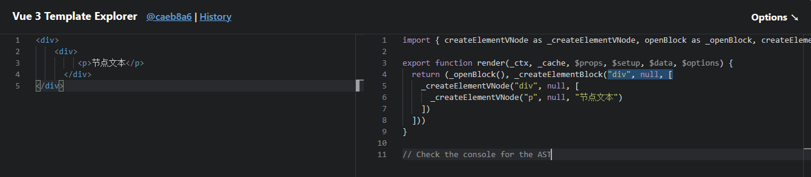

## 虚拟dom

虚拟DOM就是通过JS来生成一个AST节点树



[Vue 3 Template Explorer](https://www.iconfont.cn/)

### 为什么要有虚拟dom?

因为dom上的属性是非常多的,直接操作DOM是非常浪费性能。所以我们用JS的计算性能来换取操作DOM所消耗的性能。

## diff算法

diff算法就是比较两个虚拟dom树,找出差异,然后更新真实dom

- 无key

无key时，diff算法会通过新增/删除将旧节点替换为新节点 

- 有key

有key时，diff算法会通过isSameVNodeType方法判断节点类型、key是否一致，一致的话，再通过

1. 前序对比
2. 后序对比
3. 新节点多出，则新增
4. 旧节点多出，则删除/卸载
5. 乱序时，则求取新旧节点子树的最长递增子序列，来处理移动操作

## 最长递增子序列

二分查找:一组有序数组在折半查找

贪心算法:每一步选中时,始终选择局部最优解

回溯修正:构建一反向链表,每个节点记录上一个节点位置,最后回溯修正

``` js
function getSequence(arr: number[]): number[] {
  const p = arr.slice()
  const result = [0]
  let i, j, u, v, c
  const len = arr.length
  for (i = 0; i < len; i++) {
    const arrI = arr[i]
    if (arrI !== 0) {
      j = result[result.length - 1]
      if (arr[j] < arrI) {
        p[i] = j
        result.push(i)
        continue
      }
    // 二分查找
      u = 0
      v = result.length - 1
      while (u < v) {h
        c = (u + v) >> 1
        if (arr[result[c]] < arrI) {
          u = c + 1
        } else {
          v = c
        }
      }

      if (arrI < arr[result[u]]) {
        if (u > 0) {
          p[i] = result[u - 1]
        }
        result[u] = i //当前索引i替换当前值
      }
    }
  }
// 回溯修正
  u = result.length
  v = result[u - 1]
  while (u-- > 0) {
    result[u] = v
    v = p[v]
  }
  return result
}
```